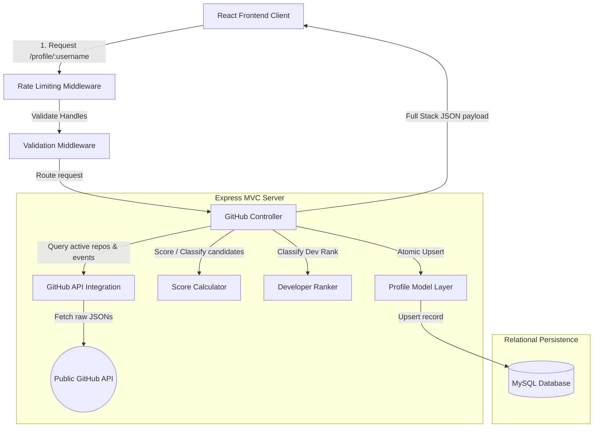

# GitGauge: SaaS GitHub Profile Analyzer 🚀

A production-ready, highly optimized **Full-Stack SaaS application** built using **React.js, Vite, Tailwind CSS v4** (Frontend Client) and **Node.js, Express.js, MySQL** (MVC Backend Server). The platform analyzes developer footprints across public GitHub API systems, aggregates stats (stars, forks, languages, lifespans), calculates weighted performance scores, and generates automated qualitative feedback.

---

## 🎨 Design System & Recruiter-wowing Visuals
- **Obsidian Theme:** Styled to emulate Linear and Vercel, utilizing cosmic dark backgrounds, glassmorphic card elements, and electric color highlights.
- **Custom React Vector Graphs:** Renders fully animated, responsive SVG visuals for the **Candidate Score Gauge** (radial dashboard), **Language Share Donut Chart** (trigonometric paths), and **Repository Comparison Bars** without installing heavy, bloated third-party charting libraries.

---

## 💻 System Architecture



---

## Folder Layout

```
github-profile-analyzer/ (workspace root)
│
├── frontend/                 # Upgraded Frontend React Application
│   ├── public/               # Static assets
│   ├── src/
│   │   ├── assets/           # Media assets and icons
│   │   ├── components/
│   │   │   ├── Navbar/       # Glassmorphic Header Component
│   │   │   ├── Footer/       # Obsidian Footer Component
│   │   │   ├── SearchBar/    # Input Console with regular expression validation
│   │   │   ├── ProfileCard/  # Static developer details card
│   │   │   ├── StatsCard/    # Analytics stats details grid
│   │   │   ├── Charts/       # Custom animated SVG vector graphs (Language share & comparisons)
│   │   │   └── Loader/       # Skeletal dashboard loaders
│   │   │
│   │   ├── pages/
│   │   │   ├── Home.jsx      # Vercel-like Landing Hero Panel
│   │   │   ├── Dashboard.jsx # Analytical candidate dashboard page
│   │   │   ├── History.jsx   # Chronicle MySQL history audit tables
│   │   │   └── NotFound.jsx  # Elegant route fallback page
│   │   │
│   │   ├── services/
│   │   │   └── api.js        # Dynamic Axios API configurator
│   │   │
│   │   ├── App.jsx           # Main React Router setup
│   │   ├── index.css         # Global tailwind v4 imports, @theme tokens
│   │   └── main.jsx          # App bootstrap entrypoint
│   │
│   ├── package.json          # Frontend packages
│   └── vite.config.js        # Vite configurations
│
├── backend/                  # Production-Grade MVC Express Backend
│   ├── config/
│   │   └── db.js             # MySQL Pool connectivity tests
│   ├── controllers/
│   │   └── githubController.js # Koordinators for candidate syncing & aggregates
│   ├── routes/
│   │   └── githubRoutes.js   # Route definitions decorated with Swagger
│   ├── services/
│   │   └── githubService.js  # Integrations with GitHub REST APIs
│   ├── models/
│   │   └── profileModel.js   # Parameterized model queries and history logging
│   ├── middleware/
│   │   ├── errorHandler.js   # Central Global Error interceptor
│   │   ├── logger.js         # Custom colored logging middleware
│   │   ├── validateRequest.js # Username regular expression validators
│   │   └── rateLimiter.js    # Strict and general API speed walls
│   ├── utils/
│   │   ├── calculateScore.js # Weighted candidate rating logic (0-100)
│   │   └── rankDeveloper.js  # Experience tier mapper (Beginner-Expert)
│   ├── app.js                # Express bootstrapping
│   ├── server.js             # Low-level signal catcher and boot listener
│   ├── .env.example          # Environment variables template
│   └── package.json          # Server packages
│
├── database/
│   └── schema.sql            # Table indices, constraints, and schemas
│
├── docs/
│   ├── API.md                # REST API design specifications
│   ├── PostmanCollection.json # Automated testing collection
│   └── INTERVIEW_PREP.md     # Advanced interview Q&As for backend shortlisting
│
└── deployment/
    ├── frontend-vercel.md    # Static deployment instructions
    └── backend-render.md     # Server and database deployment guidelines
```

---

## Setup & Local Installation

### Prerequisites
Make sure you have **Node.js** (v18.x or v20.x), **npm**, and **MySQL Server** installed locally.

### Step 1: Database Initialization
Create a MySQL database named `github_analyzer` and load the schema:
```bash
mysql -u root -p < database/schema.sql
```

### Step 2: Configure Environment Variables
Copy `.env.example` in the `/backend` folder to `.env` and fill in your database credentials:
```bash
cp backend/.env.example backend/.env
```
Fill in your local MySQL details and add a **GitHub Personal Access Token (PAT)** in `GITHUB_API_TOKEN` to prevent API rate limits (raises limit from 60 to 5000 requests/hr).

---

### Step 3: Run the Backend API
From the root directory, navigate to `/backend`, install dependencies, and start the API:
```bash
cd backend
npm install
npm run dev
```
*The API server will listen on `http://localhost:5001` with interactive docs hosted at `/api-docs`.*

---

### Step 4: Run the React Frontend Client
Open a second terminal window, navigate to the `frontend/` directory, install packages, and start Vite:
```bash
cd frontend
npm install
npm run dev
```
*Vite will compile the assets and serve the frontend at `http://localhost:5173`.*

---

## 📈 Mathematics of Candidate Evaluation Score

The platform implements a **weighted scoring algorithm** yielding a score between `0` and `100` to rate profiles:

- **Peer Validation (30% weight):** 3 points per star across all public repositories, capped at 10 stars (Max 30 points).
- **Social Reach (25% weight):** 0.5 points per follower, capped at 50 followers (Max 25 points).
- **Code Output Volume (20% weight):** 2 points per public repository, capped at 10 repos (Max 20 points).
- **Community Code Utility (15% weight):** 1.5 points per fork across public codebases, capped at 10 forks (Max 15 points).
- **Lifespan/Commitment (10% weight):** 2 points per year of account lifespan since registration, capped at 5 years (Max 10 points).

Based on the computed score, candidates are classified into development tiers:
- **Beginner Class**: Score 0 to 25.
- **Intermediate Class**: Score 26 to 55.
- **Advanced Class**: Score 56 to 80.
- **Expert Class**: Score 81 to 100.

---

## Deployment Playbook Summary

### 1. Backend Server Deployment (Railway / Render)
We recommend deploying the Express server and MySQL database to **Railway** for seamless integration:
- Provision a **MySQL Service** and load the schema.
- Create a new **Web Service** connected to your repository, set the **Root Directory** to `backend`, and link your database credentials using Railway variables.

### 2. Frontend Client Deployment (Vercel)
Deploying Vite applications to **Vercel** is extremely simple:
- Connect your repository to Vercel.
- Set the **Root Directory** to `frontend` and the framework preset to `Vite`.
- Add `VITE_API_URL` to your production API server endpoint (e.g. `https://your-backend-railway-url.app/api`).
- Click **Deploy**!
